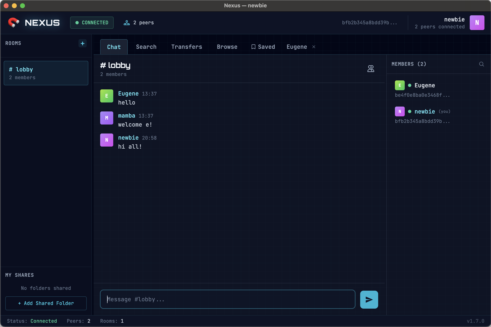

# Nexus

Decentralized P2P chat and file-sharing desktop application.

Built with Electron + React + TypeScript on the frontend and Rust (libp2p) for peer-to-peer networking. A hub server handles signaling, room chat, and user discovery, while direct messages and file transfers go peer-to-peer.



## Project Structure

```
nexus/
  apps/desktop/       Electron desktop app (React + TypeScript)
  packages/p2p-core/  Rust native addon (libp2p via napi-rs)
  infra/hub/          Hub server (Rust, Socket.IO + Axum)
  infra/bootstrap/    Bootstrap node for libp2p peer discovery
```

## Prerequisites

- **Node.js** >= 20
- **Rust** >= 1.85 (install via [rustup](https://rustup.rs))
- **npm** (comes with Node.js)

## Setup

From the root:

```bash
npm install
```

## Building the Native Addon (p2p-core)

The desktop app depends on the Rust native addon. Build it before running the app:

```bash
cd packages/p2p-core
npm run build
```

This produces a `.node` binary and auto-generated `index.js` + `index.d.ts`.

## Running in Development

### 1. Start the Hub Server

```bash
cargo run -p nexus-hub
```

Listens on port **4001** by default. Options:

```
--port <PORT>        Port to listen on (default: 4001)
--db-path <PATH>     SQLite database path (default: nexus-hub.db)
--data-dir <DIR>     Data directory for avatars (default: ./data)
```

### 2. Start the Bootstrap Node

```bash
cargo run -p nexus-bootstrap
```

Listens on port **4001** (TCP + QUIC/UDP) by default. Options:

```
--port <PORT>        Port to listen on (default: 4001)
--data-dir <DIR>     Directory for persistent identity key (default: ./data)
```

On first run it generates an ed25519 keypair and prints the PeerId. Update the dev bootstrap peers in `apps/desktop/src/shared/config.ts` if the PeerId changes.

### 3. Start the Desktop App

```bash
cd apps/desktop
npm run dev
```

In dev mode the app connects to `127.0.0.1:4001` (hub) and `127.0.0.1:4002` (bootstrap) automatically.

## Production Configuration

Before building for production, update the server addresses in **`apps/desktop/src/shared/config.ts`**:

```typescript
export const HUB_URL = import.meta.env.DEV
  ? 'http://127.0.0.1:4001'
  : 'https://your-server.com:4001'    // <-- your production hub URL

export const BOOTSTRAP_PEERS: string[] = import.meta.env.DEV
  ? [ /* local dev peers */ ]
  : [
      '/ip4/YOUR_SERVER_IP/tcp/4003/p2p/YOUR_PEER_ID',       // <-- production bootstrap
      '/ip4/YOUR_SERVER_IP/udp/4003/quic-v1/p2p/YOUR_PEER_ID',
    ]
```

Replace `YOUR_SERVER_IP` with the public IP of your server and `YOUR_PEER_ID` with the PeerId printed by the bootstrap node on first run.

## Building for Production

### Hub Server

```bash
cargo build -p nexus-hub --release
```

Binary: `target/release/nexus-hub`

### Bootstrap Node

```bash
cargo build -p nexus-bootstrap --release
```

Binary: `target/release/nexus-bootstrap`

### Desktop App

```bash
cd apps/desktop

npm run build:mac     # macOS (.dmg)
npm run build:win     # Windows (.exe)
npm run build:linux   # Linux (.AppImage, .deb, .snap)
```

Output goes to `apps/desktop/dist/`.

## Running in Production

Example for a Linux server:

```bash
# Hub (port 4001)
./nexus-hub --port 4001 --db-path /var/lib/nexus/hub.db --data-dir /var/lib/nexus/data

# Bootstrap (port 4003)
./nexus-bootstrap --port 4003 --data-dir /var/lib/nexus/bootstrap
```
